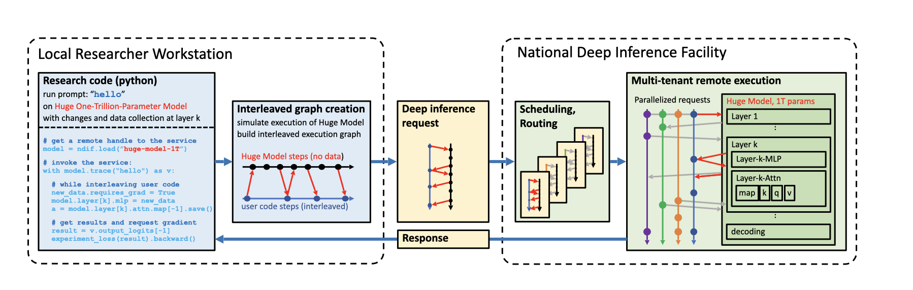

# About NNsight

## An API for transparent science on black-box AI.

!!! question "How can you study the internals of a deep network that is too large for you to run?"

    In this era of large-scale deep learning, the most interesting AI models are massive black boxes
    that are hard to run. Ordinary commercial inference service APIs let you interact with huge
    models, but they do not let you see model internals.

    The NNsight library is different: it gives you full access to all the neural network internals.
    When used together with a remote service like the [National Deep Inference Fabric](https://ndif.us/) (NDIF),
    it lets you run experiments on huge open models easily, with full transparent access. 
    NNsight is also terrific for studying smaller local models.

<figure markdown="span">
  { width="100%" }
  <figcaption>An overview of the NNsight/NDIF pipeline. Researchers write ordinary Python that runs alongside the neural network, locally or remotely. Unlike commercial inference, the experiment code can read or write any of the internal states of the network being studied: it is captured as a block and interleaved with the model's execution, taking turns with the forward pass.</figcaption>
</figure>

## How do I use NNsight?

NNsight is built on PyTorch.

Running inference on a huge remote model with NNsight is very similar to running a neural network locally on your own workstation. In fact, with NNsight, the same code for running experiments locally on small models can also be used on large models just by changing a few arguments.

The difference between NNsight and normal inference is that when you use NNsight, you do not treat the model as an opaque black box. Instead, you set up a Python `with` context that enables you to get direct access to model internals while the neural network runs.

Here is how it looks:

```python linenums="1"
from nnsight import TransformersModel
model = TransformersModel('meta-llama/Meta-Llama-3.1-70B', task='text-generation')
with model.trace('The Eiffel Tower is in the city of', remote=True):
    hidden_state = model.model.layers[10].input.save()  # save one hidden state
    model.model.layers[11].mlp.output = 0  # change one MLP module output
    output = model.output.save()  # save the model's own output object
print('The model returned', output)
print('The internal state was', hidden_state.shape)
```

Any HuggingFace model can be loaded into a `TransformersModel`, as you can see on
line 2. Notice we are loading a 70-billion parameter model, which is ordinarily
pretty difficult to load on a regular workstation since it would take 140-280
gigabytes of GPU RAM just to store the parameters.

The trick that lets us work with this huge model is on line 3. We set the flag
`remote=True` to indicate that we want to actually run the network on the remote
service. By default the remote service will be NDIF. If we want to just run a
smaller model locally on our machine, we could leave it as `remote=False`.

Notice that on line 3 we do not call the model as a function. We enter a `with`
context instead, and that is what opens the black box: inside the block, every
module of the network is reachable by name.

Lines 4-6 are what direct access looks like. Line 4 grabs the hidden state
arriving at layer 10 — `.input` hands you the tensor the module was called with,
so `hidden_state` is a `[batch, tokens, hidden]` tensor. Line 5 assigns to a
module's `.output`, which replaces the value that module passes on, so layer 11's
MLP contributes zero for the rest of the forward pass. Line 6 keeps the model's
own return value. Anything you want after the block ends has to be marked with
`.save()`; everything else is discarded when the trace tears down.

The module path is the model's real attribute path — `model.model.layers[10]` for
a Llama-family checkpoint, where the outer `model` is the NNsight wrapper and the
inner one is the transformer inside it. Print the model to see the tree, or use
[nnterp](https://ndif-team.github.io/nnterp/) if you want the same names across
architectures.

## What happens behind the scenes?

The body of the `with` block does not run where it stands. NNsight reads the
block's own source, compiles it on its own, and runs it *interleaved* with the
model's forward pass — your code and the network taking strict turns on one
thread.

Here is one turn. Your line asks for `model.model.layers[10].input`. There is no
such value yet, so your code parks, naming the location it is waiting for, and the
model runs. When layer 10 is about to run, the value is handed to your parked
code, which wakes up, does whatever you wrote, and hands a value back — the same
one, or a new one if you assigned to it. The model takes that value and carries
on. The forward pass never restarts and nothing is simulated: there is one
execution, and your code is inside it.

That is why line 5 changes the answer rather than recording it. Writing to
`.output` is not a note taken about the run; it is the value the next layer
receives.

Running remotely changes where the turns happen, not what they are. The captured
block travels to the server with the request, takes its turns beside the model
there, and the values you marked with `.save()` come back.

Basic access to model internals can give you a lot of insight about what is going on inside a large model as it runs. For example, you can use the [logit lens](https://www.lesswrong.com/posts/AcKRB8wDpdaN6v6ru/interpreting-gpt-the-logit-lens) to read internal hidden states as text. And you can use [causal tracing](https://rome.baulab.info/) or [path patching](https://arxiv.org/abs/2304.05969) or [other circuit discovery methods](https://arxiv.org/abs/2310.10348) to locate the layers and components within the network that play a decisive role in making a decision.

And with NNsight, you can use these methods on large models like Llama-3.1-70b or Llama-3.1-405b.

The NNsight library also provides full access to gradients and optimization methods, out of order module applications, cross prompt interventions, and many more features.

## Next Steps

See the [Getting Started](../getting-started/index.md) and [Features](../features/index.md) pages for more information on NNsight's functionality.

## Community

Join our community to stay connected:

- :material-forum: **[Forum](https://discuss.ndif.us/)** — Updates, feature requests, bug reports, and opportunities to help
- :fontawesome-brands-github: **[GitHub](https://github.com/ndif-team/nnsight)** — Report issues and star our project
- :fontawesome-brands-discord: **[Discord](https://discord.gg/6uFJmCSwW7)** — Real-time discussions and community support
