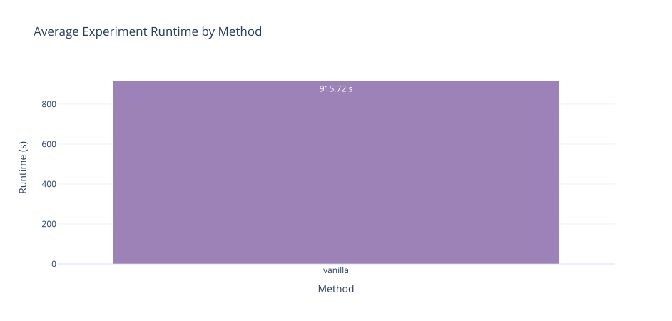
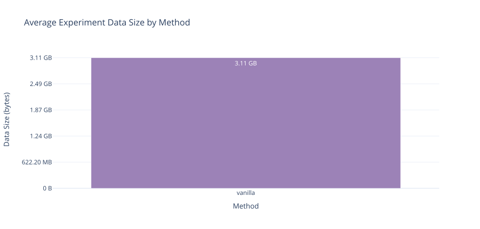
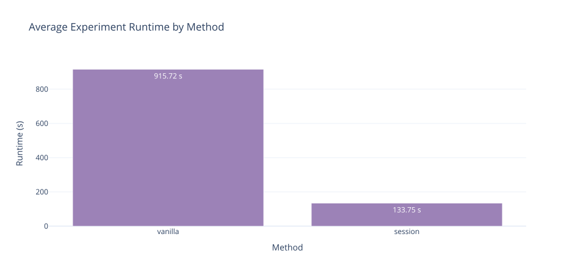
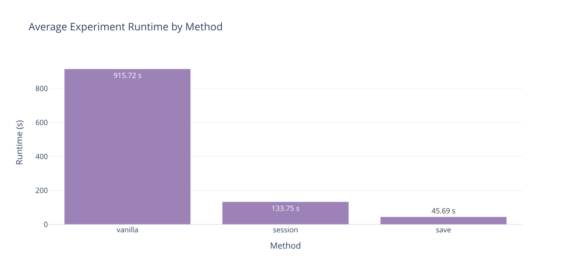
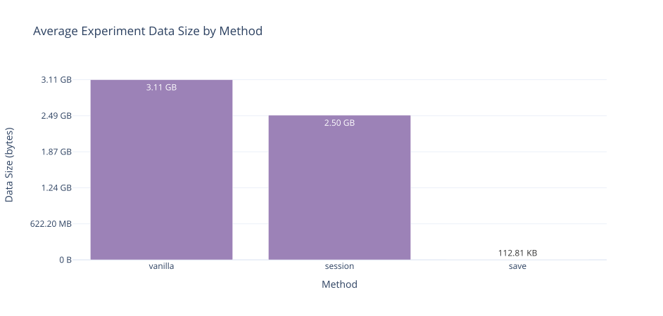
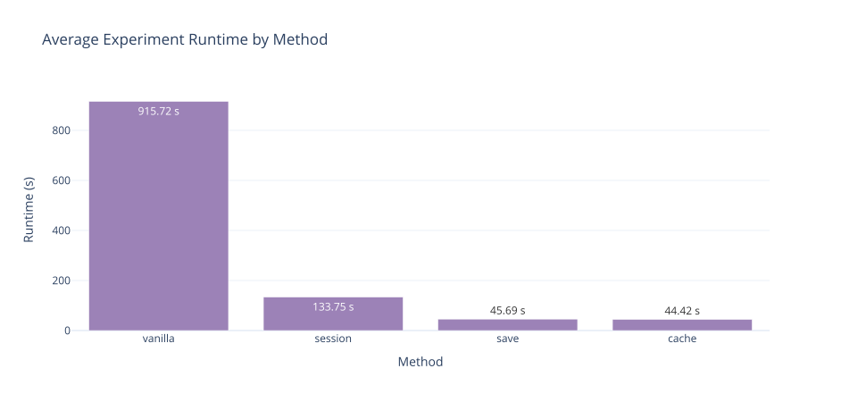
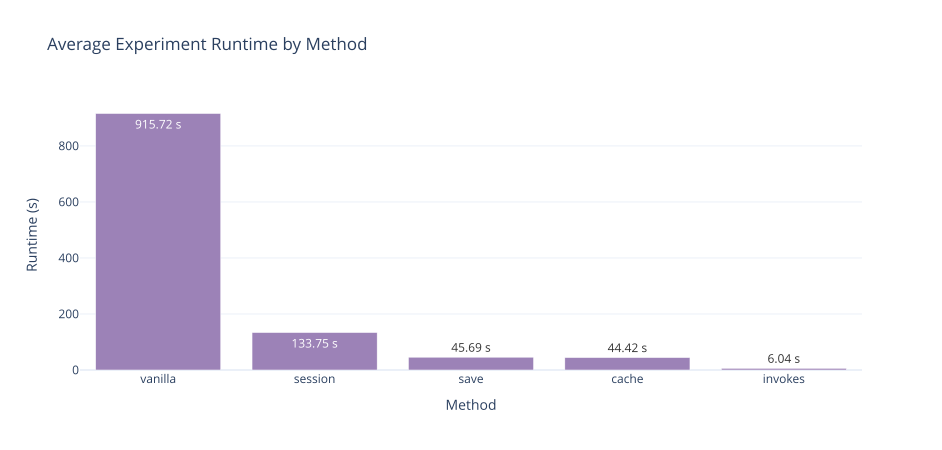
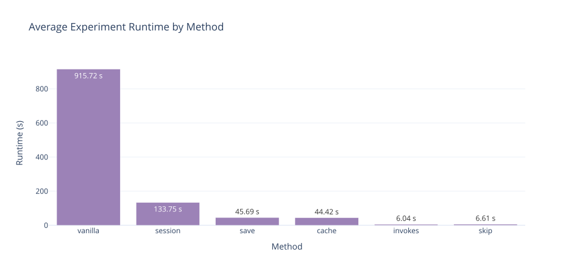
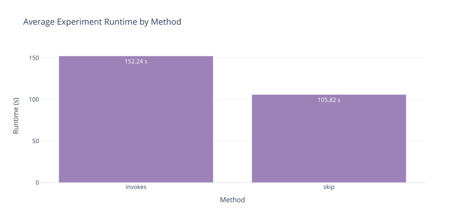
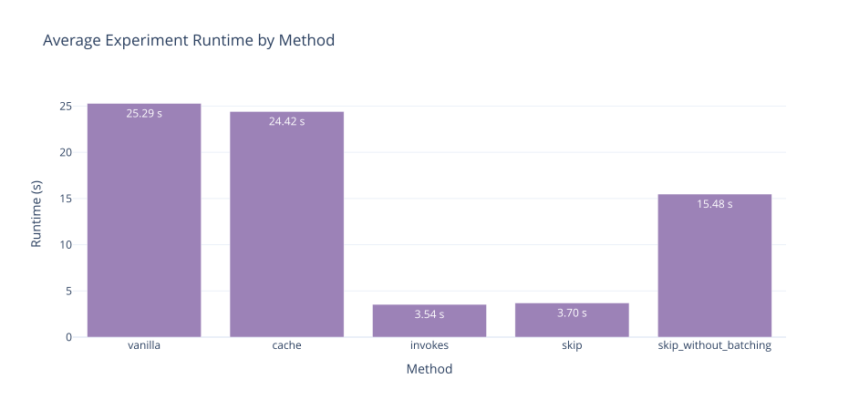

# How to make your NDIF experiment 130x faster

A user had reached out to me recently asking how they could make their nnsight code faster with NDIF to meet a project deadline. After looking at their code, I introduced a number of improvements that leverage nnsight features and remote execution principles. The result was a 130x improvement speedup. 

The experience was successful; I drew many useful lessons, and I want to share with you these key principles, so you can too optimally implement your experiments for remote execution.

### TLDR;
1. If you're doing more than one forward pass, wrap them in a `model.session`
2. Downloading large tensors can be costly, only `.save()` what you need
3. Cache all your activations in one go
4. Reduce loops with Batching Invokes
5. `.skip` what you can

<!-- more -->

## Case Study: Attention Heads Patching

Our user's experimental setup consists of a standard activation patching to compute causal scores for attention heads over a dataset of contrastive pairs. For this project, the user wanted to scale their experiment to `Llama-3.1-70B` which they can access on [NDIF](https://nnsight.net/status) via remote execution without requiring their own compute. 

As the model size grows, patching in isolation every attention head in the model starts to take very long if we don't leverage every speed up we can. To motivate the principles introduced below, let's begin by getting familiar with the vanilla implementation:

```python
# Outer loop over the model layers
for layer in range(n_layers):
	# A first forward pass caches the heads' activations
	# of a single layer from the clean prompt.
	with model.trace(clean_seq, remote=True):
		o_proj_inp = model.model.layers[layer].self_attn.o_proj.input
		clean_heads = split_heads(o_proj_inp, n_heads, h_dim).save()

	# Inner loop over the attention heads of the layer
	for head in range(n_heads):
		# Runs a forward pass for each attention head 
		# on the corrupted prompt, 
		# applying the corresponding head patch from the source prompt. 
		with model.trace(corr_seq, remote=True):
			o_proj_inp = model.model.layers[layer].self_attn.o_proj.input
			original_shape = o_proj_inp.shape  # [bsz, seq_len, model_dim]
			sub = split_heads(o_proj_inp, n_heads, h_dim)

			sub[:, -2, head, :] = clean_heads[:, -2, head, :]
			sub = sub.view(original_shape)
			new_tup = ((sub,), o_proj_inp[1])

			model.model.layers[layer].self_attn.o_proj.inputs = new_tup

			# Save the model logits from the entire corrupted prompt.
			logits = model.output.logits.save()

		# Transform the saved results locally
		stats_from_logits(logits, entities)
```

#### Performance

Because the vanilla implementation is considerably slow to run, we will be evaluating it and the rest of the proposed enhancements on `Llama-3.1-8B`.

We run each implementation multiple times `n=5` and present the findings as the average over all the runs.

* **Total Runtime**:  __915.72s__; this is the time it takes to run the entire head patching code over a single contrastive pair.

	Note: The request queue times are subtracted from this total time metric to obtain a truthful benchmark across methods, regardless of NDIF's traffic at the time of testing.

<!-- <div class="plot-blog" markdown>

</div> -->

* **Total Download Size**: __3.11GB__; this is how much data was saved and returned by the server to the client across all the requests for a single input.

<!-- <div class="plot-blog" markdown>

</div> -->

To improve on these results we will work on optimizing the following parameters:
* \# NDIF requests
* \# Forward passes
* Results size

In the vanilla implementation, every remote request is a single forward pass. The code runs a forward pass for every layer (32) and every head (32), plus an additional one per layer to cache the head inputs: 32<sup>2</sup> + 32.

| Parameter      | Amount  |
| -------------- | ------- |
| NDIF requests  | 1,056   |
| Forward passes | 1,056   |
| Result Size    | 3.11 GB |

## How to meet the deadline

### Sessions 

Naturally, each remote request introduces latency, and if you coincide with high utilization on a certain model, every one of your requests will get delayed in the queue. What you ideally want is to run multiple forward passes in a single NDIF request.

NNsight provides an API to do just that. `with model.session(remote=True):` allows you to wrap multiple tracing contexts and execute them all as part of the same NDIF request, so you can save the unnecessary back and forth latency.

This is powerful because you can also execute code before and after your forward passes directly on the remote environment.

```python
with model.session(remote=True):
	...
	
	for _ range(n):
		with model.trace(inputs):
			...
			
	...
```

Let's update the Attention Head Patching code to use the Session context.
	Note: we only need to set `remote=True` on the outer Session context.

```python
with model.session(remote=True):
	results = list().save()
	for layer in range(n_layers):
		with model.trace(clean_seq):
			o_proj_inp = model.model.layers[layer].self_attn.o_proj.input
			clean_heads = split_heads(o_proj_inp, n_heads, h_dim) # no .save()
			
		for head in range(n_heads):
			with model.trace(corr_seq):
				
				...
				
				logits = model.output.logits.to('cpu') # free memory
				results.append(logits)
					
for logits in results:
	stats_from_logits(logits, entities)
```

The Session context acts as one NNsight execution environment. Therefore, variables can be referenced across traces without having to save them first. For Activation Patching, activations can be patched from one forward pass to another without storing intermediately.

#### Performance

Introducing the Session context brings our number of NDIF requests down to only 1 and consequently also reduces the total data download.

| Parameter      | Amount  |
| -------------- | ------- |
| NDIF requests  | 1       |
| Forward passes | 1056    |
| Result Size    | 2.50 GB |

<div class="plot-blog" markdown>

</div>

We made the experiment code 6x faster!

### Save only what you need

This may be the most overlooked principle discussed in this blog, but it's one that makes a significant improvement to your experiment for no added effort. 

In the vanilla implementation, the logits are saved for each patched run to which  `stats_from_logits` is then applied locally, but really all it does is getting the probability and logits of the top prediction and the target entity's tokens.

Instead of doing this final operation locally, let's call it on the logits within the tracing context before adding it to the final results.

```python
with model.session(remote=True):
	results = list().save()
	for layer in range(n_layers):
		with model.trace(clean_seq):
			o_proj_inp = model.model.layers[layer].self_attn.o_proj.input
			clean_heads = split_heads(o_proj_inp, n_heads, h_dim) # no .save()
			
		for head in range(n_heads):
			with model.trace(corr_seq):
				
				...
				
				logits = model.output.logits
				
				# transform the data here
				results.append(stats_from_logits(logits, entities))
```

#### Performance

By transforming the data remotely and only saving the results required for our use case, we bring the results' size down by a factor of 27,000.

| Parameter      | Amount    |
| -------------- | --------- |
| NDIF requests  | 1         |
| Forward passes | 1056      |
| Result Size    | 112.81 KB |

<div class="plot-blog" markdown>

</div>

<div class="plot-blog" markdown>

</div>

This improvement makes another significant impact on the latency as we reduce it by almost 3x more and 21x overall!

### Caching in one go

Now, we turn our attention to the number of forward passes ran on the model. Currently, the code performs one forward pass per layer activation to cache; let's rewrite that instead to cache all the layer outputs in one forward pass.

```python
with model.session(remote=True):
	clean_heads = list()
	with model.trace(clean_seq):
		# loop inside the trace
		for layer in range(n_layers):
			o_proj_inp = model.model.layers[layer].self_attn.o_proj.input
			clean_heads.append(split_heads(o_proj_inp, n_heads, h_dim))

	results = list().save()
	for layer in range(n_layers):
		for head in range(n_heads):
			with model.trace(corr_seq):
				
				...
				
				logits = model.output.logits
				results.append(stats_from_logits(logits, entities))
```

#### Performance

For `Llama-3.1-8B`, this refactoring saves us 31 extra forward passes. Everything else remains the same.

| Parameter      | Amount    |
| -------------- | --------- |
| NDIF requests  | 1         |
| Forward passes | 1025      |
| Result Size    | 112.81 KB |

<div class="plot-blog" markdown>

</div>

The speedup here is not significant. However, I anticipate it will be impactful as your model size or sequence lengths, i.e. each individual forward pass becomes more expensive. Therefore, it is still worth adopting as a better practice, as long as you can afford the memory cost.

### Batching

One of the most powerful NNsight features available to us is the `.invoke` API for batching interventions during runtime while retaining the ability to intervene on each batch in isolation. The implication is that you can apply different interventions to different sequences in the forward pass and without having to manage slicing and indices.

The syntax looks the following:
```python
with model.trace() as tracer:
	with tracer.invoke(batch_1):
		# intervene here
		...
		
	with tracer.invoke(batch_2):
		# intervene here
		...
```

The Invoker context only applies the interventions to the batch slice it was provided, and the indices are treated as if it was the only input to the forward pass.

For our Attention Head Activation Patching, we will leverage batching to parallelize the patched runs over multiple heads. For `Llama-3.1-8B`, we can batch all the heads in a single layer at once. In practice, this means to move the loop over the heads inside the tracing context, such that each iteration creates an invoker context per patched head.

```python
with model.session(remote=True):
	clean_heads = list()
	with model.trace(clean_seq):
		for layer in range(n_layers):
			o_proj_inp = model.model.layers[layer].self_attn.o_proj.input
			clean_heads.append(split_heads(o_proj_inp, n_heads, h_dim))

	results = list().save()
	for layer in range(n_layers):
		with model.trace() as tracer: # don't pass the input here
			for head in range(n_heads): # loop over the heads
				with tracer.invoke(corr_seq): # input passed here
					
					...
					
					logits = model.output.logits
					results.append(stats_from_logits(logits, entities))
```

#### Performance

Batching allows us to reduce the number of forward passes from (num_layers * num_heads) to (num_layers * num_heads / batch_size), and in our case that would just be 32 runs + 1 (clean prompt run for caching).

| Parameter      | Amount    |
| -------------- | --------- |
| NDIF requests  | 1         |
| Forward passes | 33        |
| Result Size    | 112.81 KB |

<div class="plot-blog" markdown>

</div>

Doing so, we reach another significant speedup of +7x. In totality, this is more than 130x speed improvement.

### Module skipping

While we go over skipping redundant computation, I hope you don't decide to skip this section. 

This far, we were successful in reducing the number of forward passes to roughly one per layer. However, since all the forward passes take in the same input data, each pass is redundantly recomputing the same layer results up until the patching point.

Hence, our next optimization will be to pre-cache the unpatched layer outputs and use them to completely skip all the layers leading up to the point of patching in the model. To achieve that, NNsight implements a [`.skip(<value>)`](https://nnsight.net/features/11_skip/) API that you can call on any module to skip its forward pass entirely. The method call takes in the value that will act as the output of the skipped module to propagate to the next module in line.

```python
with model.trace(prompt, remote=True):
	model.model.layers[5].skip(new_output)
```

For our Activation Patching implementation, this means doing an extra forward pass on the clean prompt to cache layer outputs and adding logic at the top of the patch invoker to skip all prior layers.

```python
with model.session(remote=True):
	clean_heads = list()
	with model.trace(clean_seq):
		for layer in range(n_layers):
			o_proj_inp = model.model.layers[layer].self_attn.o_proj.input
			clean_heads.append(split_heads(o_proj_inp, n_heads, h_dim))
			
	# cache unpatched activations
	corr_acts = list()
	with model.trace(corr_seq):
		for layer in range(n_layers):
			corr_acts.append(model.model.layers[layer].output)

	results = list().save()
	for layer in range(n_layers):
		with model.trace() as tracer: # don't pass the input here
			for head in range(n_heads): # loop over the heads
				with tracer.invoke(corr_seq): # input passed here
					for layer_to_skip in range(layer):
						# skip all the layers leading to the patch
						model.model.layers[layer_to_skip].skip(corr_acts[layer_to_skip])
					
					...
					
					logits = model.output.logits
					results.append(stats_from_logits(logits, entities))
```

#### Performance

| Parameter      | Amount    |
| -------------- | --------- |
| NDIF requests  | 1         |
| Forward passes | 34        |
| Result Size    | 112.81 KB |

<div class="plot-blog" markdown>

</div>

The final improvement we introduce does not reveal to be speeding things up for our setup and is even a tiny bit slower. But, I wonder if we can see a different affect on a larger model?

#### Performance on `Llama-3.1-70B`

<div class="plot-blog" markdown>

</div>

Scaling the benchmark to a larger model reveals speedup gains using the layer skipping logic. Compared to our last optimized iteration with batching, we obtain a 40% speed increase when we pair it with skipping earlier layers. I anticipate that speedups can also be felt on "smaller" models if working with larger input sequences.

Since the implementation from the previous section is only slightly faster than the one we just covered, I recommend you implement module skipping in your experiment when applicable, so it can be reusable across model sizes and benefit from that extra performance boost.

## Benchmarking Local Execution

If you came here to figure out how to run your experiments faster and more efficiently on NDIF, I hope you were able to learn a few useful tricks.

To conclude, I want the readers researching on their models in a local tracing setup to also get some important takeaways that they can leverage to speedup their experiments.

Let's re-run some of the implementations we came up with earlier but this time on a local GPU node and see how well the speed improvements transfer.

<div class="plot-blog" markdown>

</div>

The Activation Patching implementation using invoker batching and module skipping yield a 7x speedup compared to the base implementation. Leveraging NNsight features can optimize your experiment a long way!

If you are constrained by memory limits and can't rely on batching, the benchmark shows that you can get a decent 40% speed increase by adding layer skipping even when not paired with batching.

##

If all of this is new to you and you've never accessed models on NDIF before, visit [login.ndif.us](https://login.ndif.us) and get started with your API key!


<details markdown>

<summary><strong>System Config</strong></summary>

<table>                                                                                                                  
    <tr><td>nnsight</td><td>0.6.3</td></tr>
    <tr><td>transformers</td><td>5.5.4</td></tr>                                                                           
    <tr><td>torch</td><td>2.11.0+cu130</td></tr>
    <tr><td>GPU</td><td>RTX 6000 Ada Generation</td></tr>                                                                  
  </table>      

</details>
