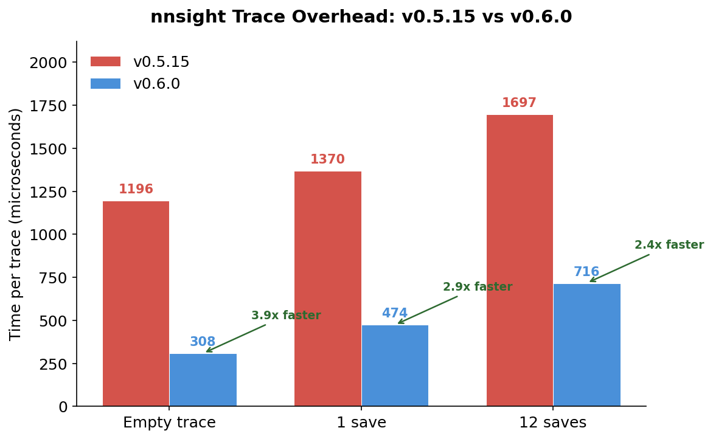
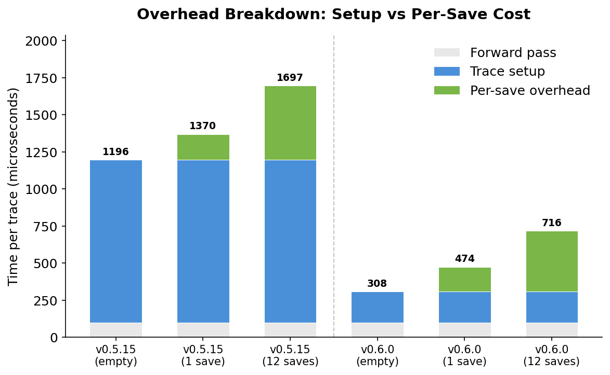
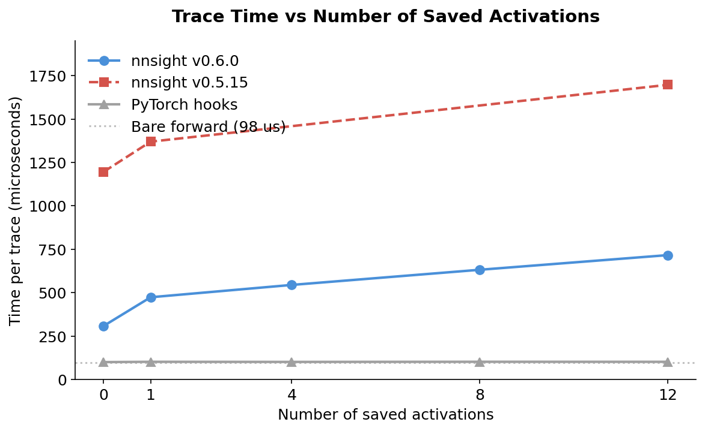
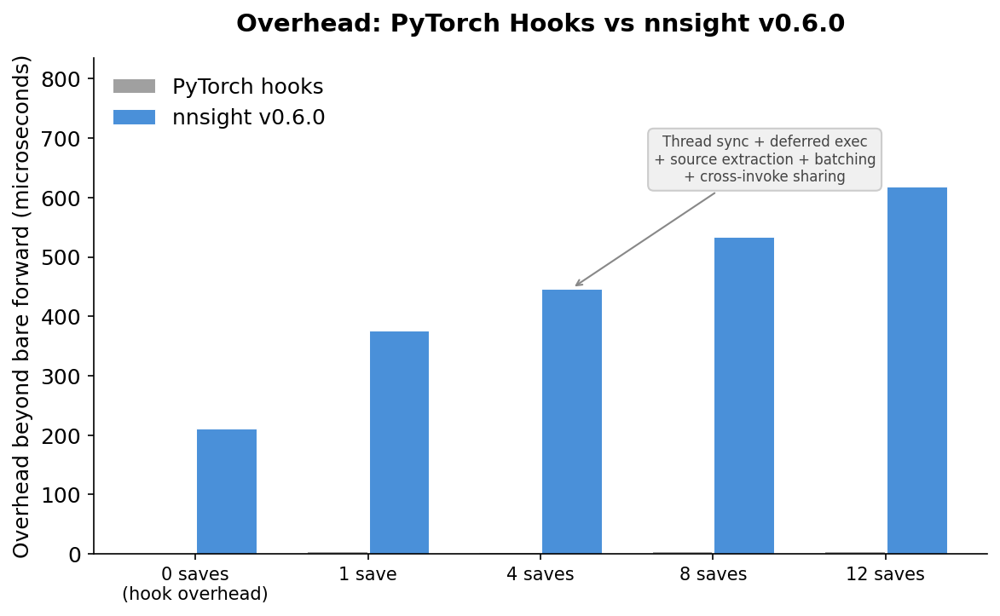

# NNsight 0.6

*By Jaden Fiotto-Kaufman*

NNsight is releasing its sixth major version, focused on addressing user feedback about common hurdles with the library. Before getting into what changed, here's what nnsight is and why it exists.

<!-- more -->

## What is NNsight?

NNsight is a Python library for interpreting and intervening on the internals of PyTorch models. You wrap a model, open a tracing context, and read or write activations at any layer.

```python
from nnsight import LanguageModel

model = LanguageModel("openai-community/gpt2", device_map="auto", dispatch=True)

with model.trace("The Eiffel Tower is in"):
    # Read the hidden states at layer 5
    hidden = model.transformer.h[5].output[0].save()

    # Zero out the MLP output at layer 0
    model.transformer.h[0].mlp.output[:] = 0
```

Under the hood, nnsight uses deferred execution. When you enter `with model.trace(...)`, your code is extracted via AST, compiled into a function, and run in a worker thread. When that thread accesses `.output`, it blocks until the model's forward pass reaches that layer and provides the real tensor through a PyTorch hook. This means your intervention code runs inline with the forward pass—no proxies, no fake tensors. You're working with real PyTorch values.

### Remote Execution with NDIF

NNsight pairs with [NDIF](https://ndif.us) (National Deep Inference Fabric), a research computing platform that lets you run the same intervention code on large models hosted remotely. You don't need a local GPU. Just add `remote=True`:

```python
model = LanguageModel("meta-llama/Llama-3.1-70B")

with model.trace("The Eiffel Tower is in", remote=True):
    hidden = model.transformer.h[5].output[0].save()
```

The model loads on meta device locally (no GPU memory used), and NDIF handles execution on its infrastructure. Same API, same code.

## What Was Painful

We heard consistent feedback about a few friction points:

- **Cryptic errors.** When something went wrong inside a trace, the stack trace pointed to nnsight internals instead of your code. Debugging meant guessing which line in your script actually caused the error.
- **Custom code on NDIF didn't work.** If you had local analysis functions or modules, they wouldn't run on NDIF because the server didn't have your packages installed. You had to inline everything.
- **Keyword-only inputs broke.** Passing `input_ids=my_ids` to `.trace()` without positional arguments would incorrectly wait for sub-invokers instead of running a forward pass.
- **Performance overhead.** Every trace paid the full cost of source extraction, AST parsing, and compilation—even if you'd run the exact same trace a thousand times. Thread creation and pymount lifecycle added up.

## What's New

### Custom Code on NDIF

The biggest change: nnsight now serializes functions and classes by value (source code) rather than by reference. Your local packages get sent along with your request and rebuilt on the server—even if they aren't installed on NDIF.

```python
from nnsight import ndif, LanguageModel
import mymodule

ndif.register(mymodule)

model = LanguageModel("meta-llama/Llama-3.1-70B")

with model.trace("Hello world", remote=True):
    result = mymodule.my_analysis_function(model).save()
```

Anything defined in your main script or working directory is auto-registered. More broadly, any package on your local Python path that isn't in `site-packages` (i.e. not pip-installed) is auto-registered too. You only need to call `ndif.register()` for pip-installed local packages. Python 3.9+ clients now work with NDIF regardless of server Python version.

A real example of where this matters: [nnterp](https://github.com/ndif-team/nnterp) is a library built on nnsight that standardizes transformer interfaces across model families. NDIF doesn't have nnterp installed, but that doesn't matter—just register it:

```python
from nnterp import StandardizedTransformer
from nnsight import ndif
import nnterp

ndif.register(nnterp)

model = StandardizedTransformer("meta-llama/Llama-3.1-70B")

with model.trace("hello", remote=True):
    layer_5_output = model.layers_output[5]
    model.layers_output[10] = layer_5_output
```

This decouples library development from server deployment. nnterp can ship new features and fixes without waiting for NDIF to update its installation—you always run the version you have locally.

You can also test serialization locally before submitting remote jobs with `remote='local'`, and compare your environment against NDIF's with `ndif.compare()`.

### Cleaner Error Messages

Exceptions inside traces now show clean stack traces pointing to your original code:

```
Traceback (most recent call last):
  File "my_script.py", line 9, in <module>
    with model.trace("Hello world"):
  File "my_script.py", line 11, in <module>
    output = model.transformer.h[999].output.save()

IndexError: list index out of range
```

No nnsight internals in the traceback. If you need the full trace for debugging nnsight itself, run with `python -d my_script.py`.

### Smarter Input Detection

Previously, nnsight checked for positional arguments to decide whether to create an implicit invoker. Keyword-only inputs like `input_ids=my_ids` would silently fail. Now the batching logic inspects whether arguments affect batch size. This just works:

```python
with model.trace(input_ids=my_ids):
    hidden = model.transformer.h[0].output[0].save()
```

### For-Loop Iteration

`tracer.iter` now supports standard Python `for` loops as an alternative to `with` blocks. The `for` version is faster because it runs inline in the worker thread—no source extraction or compilation for the loop body.

```python
with model.generate("Hello", max_new_tokens=5) as tracer:
    logits = list().save()
    for step in tracer.iter[:]:
        logits.append(model.lm_head.output[0][-1].argmax(dim=-1))
```

Bounded slices (`iter[:3]`), single indices (`iter[0]`), and lists (`iter[[0, 2, 4]]`) all work.

### Performance: 2.4–3.9x Faster Traces

Trace overhead has been cut significantly. On a 12-layer MLP benchmark (CPU):

| Scenario | v0.5.15 | v0.6.0 | Speedup |
|----------|---------|--------|---------|
| Empty trace | 1,196 µs | 308 µs | **3.9x** |
| 1 `.save()` | 1,370 µs | 474 µs | **2.9x** |
| 12 `.save()` calls | 1,697 µs | 716 µs | **2.4x** |

The fixed setup cost (source extraction, AST parsing, compilation, thread creation) dropped from ~1,100 µs to ~210 µs. Per-intervention cost dropped from ~42 µs to ~34 µs.



Most of the improvement is in setup cost. The overhead breakdown shows how trace setup dominates in v0.5.15, while v0.6.0 shrinks it to a fraction:



As the number of interventions grows, v0.6.0 scales much better than v0.5.15. Both are still above bare PyTorch hooks, but the gap narrows with more saves:



The remaining overhead beyond raw PyTorch hooks comes from nnsight's feature set: thread-based deferred execution, source extraction, automatic batching, cross-invoke variable sharing, and the mediator protocol. This overhead is constant regardless of model size—for real models where the forward pass takes milliseconds or seconds, it's negligible.



Where the savings come from:

- **Always-on trace caching.** Source, AST, and compiled code objects are cached per call site. First trace pays full cost; subsequent calls skip compilation entirely.
- **Persistent pymount.** `.save()` and `.stop()` are mounted once at import and never unmounted, eliminating `PyType_Modified()` calls that invalidated all Python type caches on every trace enter/exit.
- **Removed `torch._dynamo.disable` wrappers.** The decorator on hook functions added unnecessary `set_eval_frame` C calls on every module forward. Removing it saves ~4 C calls per hook.
- **Batched `PyFrame_LocalsToFast`.** Cross-invoker variable sharing now syncs all variables in one C API call instead of one per variable.
- **Filtered globals copy.** Intervention threads now only copy the global names referenced in the bytecode, not the entire module globals dict.

### Agent Support

NNsight now has first-class support for AI coding agents. We've built a [skills repository](https://github.com/ndif-team/skills) that integrates with Claude Code and OpenAI Codex—install it once and your agent knows how to write nnsight code. We also support [Context7](https://github.com/upstash/context7) as an MCP server, so any MCP-compatible LLM client can pull up-to-date nnsight documentation on the fly. For agents that work with raw context files, the repo includes [CLAUDE.md](https://github.com/ndif-team/nnsight/blob/main/CLAUDE.md) and [NNsight.md](https://github.com/ndif-team/nnsight/blob/main/NNsight.md)—comprehensive guides covering the full API, common patterns, gotchas, and debugging tips. The goal is to make nnsight as easy for agents to use as it is for humans.

### Other Changes

- **vLLM 0.14.1 support.** Updated integration for the latest vLLM. If you need fast token generation with interventions, vLLM is the way to go—nnsight hooks into its execution path the same way it does with HuggingFace models.
- **Multiple wrappers on the same model.** You can now wrap the same PyTorch model with multiple `NNsight` instances without breaking hooks.
- **`python -c` support.** `python -c "from nnsight import ..."` now works.
- **Compressed NDIF results.** Results are compressed with zstandard for smaller downloads.
- **Memory leak fixes.** Fixed reference loops in the interleaver and tracer.

### Breaking Changes

If you have custom model classes that implement `_prepare_input` or `_batch`, you may need to update them to match the new signature in `nnsight/intervention/batching.py`.

## Where NNsight Is Headed

Interpretability research is fragmented. Every paper rolls its own hooks, its own activation patching, its own way of naming layers. Techniques that work on GPT-2 break on Llama because the module paths are different. Results are hard to reproduce because the tooling isn't shared.

NNsight and the projects around it are trying to fix that—standardize how people write, share, and run interpretability code so the field can build on itself instead of reimplementing the same primitives.

Here's what's in progress:

- **[nnterp](https://github.com/ndif-team/nnterp)** — a library built on nnsight that gives all transformer architectures the same interface. Different model families use different naming conventions for identical components. nnterp maps them to a common API so techniques like logit lens, activation patching, and steering work out of the box on any supported model. Write your method once, run it on GPT-2, Llama, Gemma, or Qwen without changing a line.
- **[Cookbook](https://github.com/ndif-team/cookbook)** — a growing collection of mechanistic interpretability paper replications, implemented with nnsight and nnterp. Each one is a runnable Colab notebook that executes on NDIF, so you can reproduce published results on large models without local GPUs. The goal is a shared reference library the field can build on.
- **[Circuit Tracer](https://github.com/safety-research/circuit-tracer-dev/)** — tools for finding and visualizing circuits using cross-layer transcoder features. Find attribution graphs, annotate them, and intervene on specific features to observe effects on model output.
- **[Workbench](https://workbench.ndif.us)** — a web UI for exploratory interpretability research. Built on nnsight and NDIF, it gives you an interactive environment for probing model internals without writing code.
- **SAEs and LoRA adapters on NDIF** — support for running sparse autoencoders and adapter layers on NDIF's hosted models, so you can do feature-level analysis on large models without downloading anything.
- **[Open-source NDIF](https://github.com/ndif-team/ndif)** — the NDIF server is open source and pip-installable, so anyone can deploy their own NDIF cluster. If you have GPUs and want to host models for your lab or organization, `pip install ndif` gets you a working instance.

---

NNsight 0.6 is available now: `pip install nnsight --upgrade`

Docs: [nnsight.net](https://nnsight.net) · GitHub: [github.com/ndif-team/nnsight](https://github.com/ndif-team/nnsight) · Forum: [discuss.ndif.us](https://discuss.ndif.us) · Discord: [discord.gg/6uFJmCSwW7](https://discord.gg/6uFJmCSwW7)
